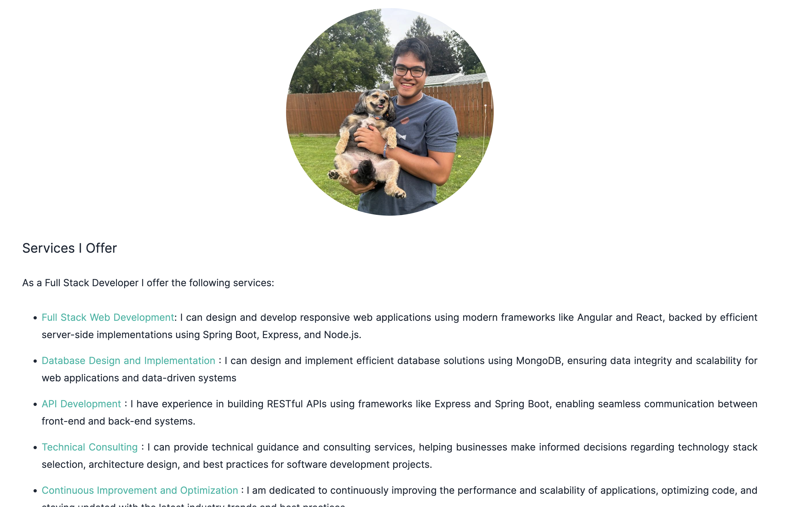
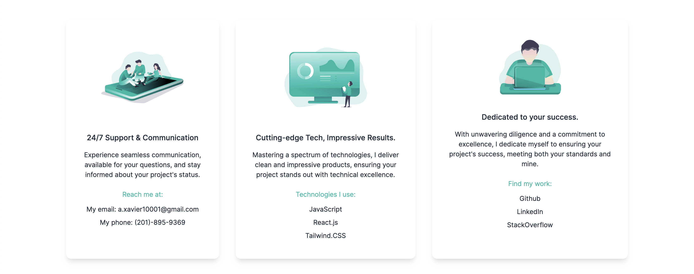
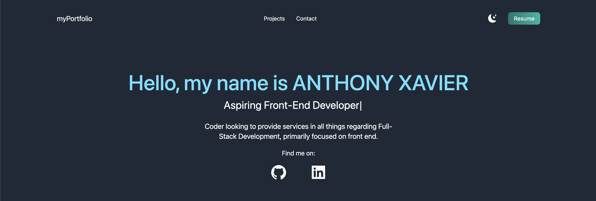
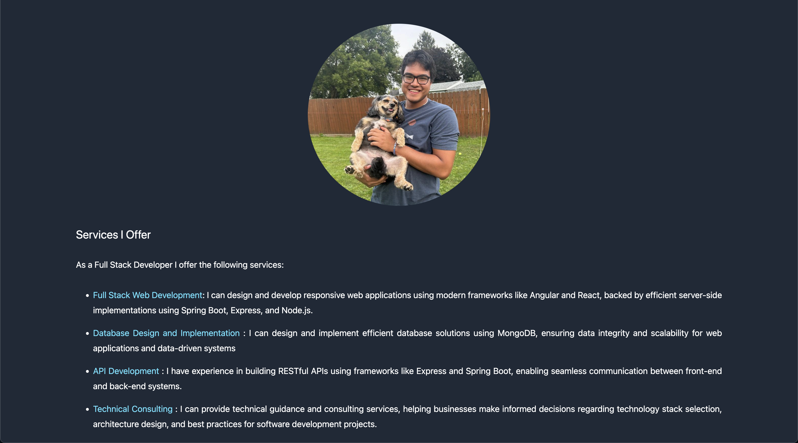
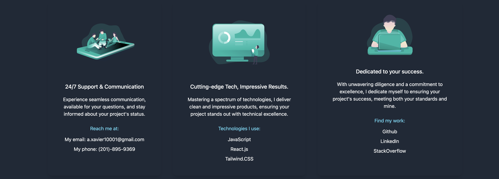

# Portfolio Website

This is a portfolio website built using Next.js and Tailwind CSS. It showcases my projects, skills, and provides information about me.

- Visit the Website : https://quiet-pixie-5702c0.netlify.app/ 

## Table of Contents

- [Images](#images)

## Images

### Light Theme

- Landing Page

  

  
- About Section

  

  
- Skills Section

  
  

- Contact Me

  

### Dark Mode

- Landing Page

  
  

- About Section

  
  
- Skills Section

  

- Contact Me

  

